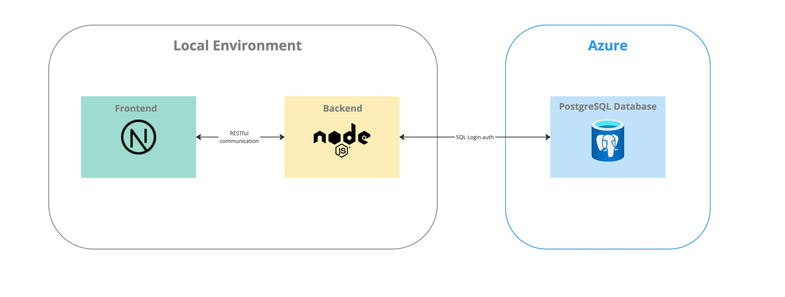

# Fullstack Exercise

Smartbi Fullstack Engineer Challenge


(**note:** Database is actually a Microsoft SQL Server instance.)

# Challenge Instructions

Welcome to the Smartbi Fullstack Developer Challenge! In this challenge, you will be working with a [monorepo application built on top of Turborepo](https://github.com/vercel/turbo/tree/main/examples/with-docker) that contains both frontend and backend codebases. Your task is to copy the project base and implement features described in the product backlog. You are limited by time, so **you have only five hours maximum to use on this challenge**. The aim is to complete as many backlog items as possible whilst still ensuring quality code and proper documentation. You will not most likely have enough time to do everything. The items in the Product Backlog are not prioritized, so you can implement them in any order you prefer.

You should implement frontend functionality in the `apps/web` folder. Instead of using Next.js’s built-in API functionality, all backend functionality should be implemented in the `apps/api` directory.

# Figma UI Prototype

Your task is to implement the features outlined in the [Figma prototype](https://www.figma.com/proto/Fa9a8bEWbN9qwfFNdGpBQR/Fullstack-exercise?page-id=0%3A1&node-id=86-85&node-type=frame&viewport=683%2C454%2C0.73&t=cfMjLAhob468aW6r-1&scaling=min-zoom&content-scaling=fixed&starting-point-node-id=1%3A2), while maintaining the same look and feel as the design.

# Product Backlog

### Database & Backend Development

- As a database engineer, I want to store a list of factories and their equipment (including operational statuses) in an SQL Server database so that the data can be used across the application.
- As a backend developer, I want to set up a secure connection to an SQL Server database using SQL login so that I can store, retrieve, and update data.
- As a backend developer, I want to create a REST API endpoint to retrieve a list of factories from the database so that the data can be displayed in the frontend.
- As a backend developer, I want to create a REST API endpoint to retrieve equipment data for a specific factory so that users can view equipment and their current operational statuses.
- As a backend developer, I want to create a REST API endpoint to update the operational status of equipment (e.g., toggling on/off) so that changes made in the frontend are persisted to the database.
- As a backend developer, I want to create a REST API endpoint to insert new factories and their equipment data into the database so that users can add new entries through the frontend.
- As a backend developer, I want to ensure that the API endpoints return appropriate error messages and status codes (e.g., 400, 404, 500) for better debugging and error handling.
- As a backend developer, I want to create a REST API endpoint to update the name of an existing factory so that users can rename factories from the frontend.

### Frontend Development

- As a frontend developer, I want to create a home page that displays a list of factories retrieved from the backend so that users can view all available factories.
- As a frontend developer, I want to create a detailed view for a specific factory, showing a list of equipment and their current operational statuses so that users can monitor the equipment.
- As a frontend developer, I want to implement toggle switches in the equipment view so that users can change the operational status (on/off) of equipment.
- As a frontend developer, I want the frontend to send updates to the backend when an equipment status is toggled so that changes are reflected in the database.
- As a frontend developer, I want to display confirmation or error messages after an equipment status update to inform the user about the result of their action.
- As a frontend developer, I want to create a form that allows users to add new factories and equipment so that the data can be submitted to the backend.
- As a frontend developer, I want to add an option to edit the name of a factory in the factory list view so that users can rename factories directly in the UI.

### Application Deployment & Security

- As a developer, I want to dockerize the fullstack application so that it can be easily deployed and run in a containerized environment.
- As a developer, I want to implement basic authentication for the application so that only authorized users can access certain endpoints (e.g., status updates, adding data).
- As a developer, I want to set up environment variables for sensitive information such as database connection strings and secrets to enhance security.

### Testing & Monitoring

- As a developer, I want to implement unit tests for the backend REST API endpoints to ensure reliable functionality when retrieving, updating, or inserting data.
- As a developer, I want to implement frontend testing (e.g., with Jest or Cypress) to ensure UI components work correctly, such as toggling equipment status or submitting a form.
- As a developer, I want to add logging and error monitoring to both the backend and frontend so that issues can be identified and resolved efficiently.

## General notes:

- Backend reads/writes data to a Microsoft SQL Server instance hosted on Azure.
- Database communication should be performed using an ORM/Query builder (eg. Knex.js)
- Continue your work using the given Frontend base UI.
- You should avoid using any types and instead use proper TypeScript types and interfaces.
- You should follow the Figma prototype as a guide but may apply creative flexibility when implementing specific features.
- Code should be clean, readable, and modular.
- You have a maximum of five hours to complete this task. While you can spend less time, you must not exceed the five-hour limit.
- **Do not commit database credentials (or any other secrets) to GitHub.**

## Version control and Getting Started

- Use of version control is mandatory
- You are given a .zip file containing base code for the project
- Create a new project in your own Github account (public project) and push project base there
- Create a new branch called 'challenge'
- Commit all changes to the 'challenge' branch
- Include meaningful commit messages explaining changes.
- Once the submission is finished, create a Pull Request to the main branch
- Pull Request will be verified by Smartbi engineers
- You are free to keep the project in your personal Github

## Running project locally

1. Install dependencies:

```bash
yarn intall
```

2. Start the development server:

```bash
yarn dev
```
